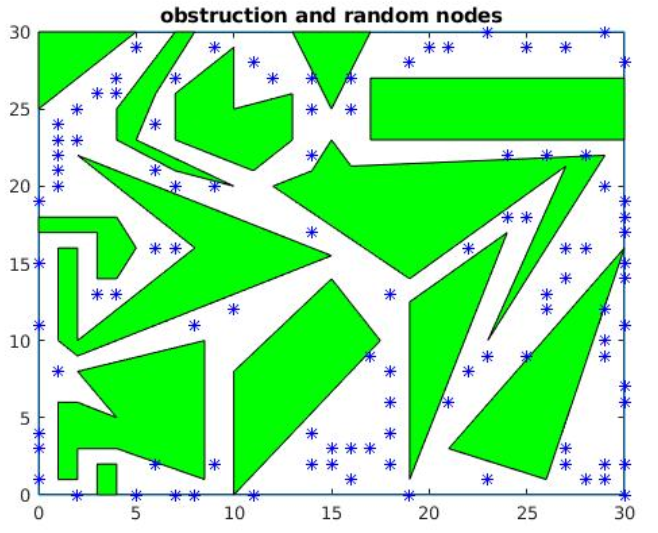
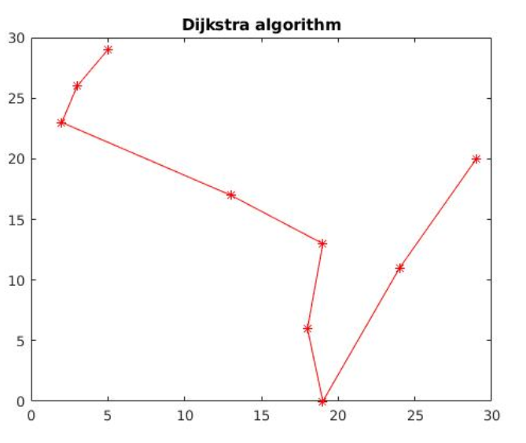
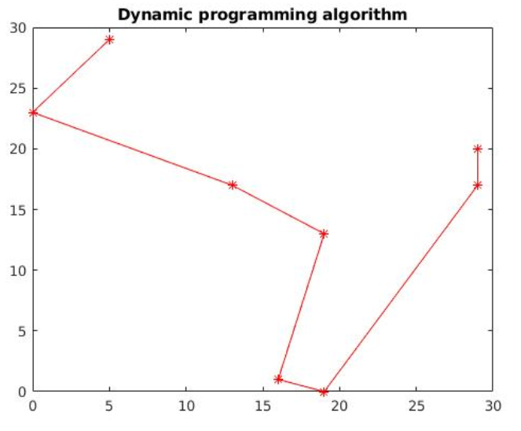
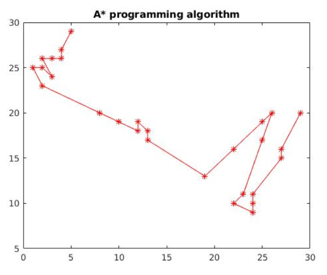

# Robotics
Robotics course: Robot modeling, Mechatronics &amp; robot programming, Mobile robots etc. 
These repository contains several assignments from different robotics courses in Tampere University

## Fundamentals of mobile robots: 
contains experiments on algorithms for optimal path finding such as a*, dynamic & dijkstra. The assignments also experiments with SLAM, Binary occupancy grid mapping and various filter such as kalman filter, monte-carlo filter etc.

following figures shows a given map with way points nodes and obstacles and the shortest path derived from different algorithms:

| Dijkstra algorithm | Dynamic programming | a* algorithm  |
|--------------------|---------------------|---------------|
|   |  |  |

other groupmate: Amir sefat and Palash halder

## Mecharonics and robot programming:

This course emphasizes on integration of various device with ROS. We used Murata IMU sensor, Leddar(x16) sensor and Microsoft Kinect to connect with ROS and store data in different format and analyzed different capabilities of those devises. The experiment includes oritentation analysis, mapping with, blob/face detection, visualization in RViz, saving data as pointcloud etc. 

The following figure shows a typical process we used for sensor integration
<image src = "img/ROSLedder.PNG" alt = "lego robot" width = 520>

Following figures show several experimentation with the sensor outputs.
<table>
  <tr>
     <td>Sensor integration</td>
     <td>Sensor integration</td>
     <td>Sensor integration</td>
  </tr>
  <tr>
    <td><image src = "img/Murata.PNG" alt = "murata sensor" width = 250> ></td>
    <td><image src = "img/Murata1.PNG" alt = "murata sensor" width = 250></td>
    <td><image src = "img/ledderRViz.PNG" alt = "murata sensor" width = 250></td>
  </tr>
 </table>

Following images show (i) Leddar integration and (ii) blob detection with Kinect using ROS framework.
<table>
  <tr>
     <td>Sensor integration</td>
     <td>Sensor integration</td>
     
  </tr>
  <tr>
    <td><image src = "img/rviz_screenshot.png" alt = "murata sensor" width = 340></td>
    <td><image src = "img/blobDetection.PNG" alt = "kinect sensor" width = 340></td>
  </tr>
 </table>
  

Other part of the course includes connecting Turtlebox and Franka panda robot with ROS and experiment on their movement capabilities. For example we used Turtlebot to follow various programmed path shapes(number 8, rectangle, circle, triangle etc.) and various kinematics with franka panda robot

Following figure is an example of movement of franka panda controlled using ROS.

<image src = "img/Screenshot from 2019-02-22 14-18-22.png" alt = "movement of franka panda" width = 370> 
  
other groupmates: Severi Keisala, Harri Maeskanen, Pekka Maenpaa

## Robot Manipulators: Modeling, Calculation and Programming: 

This course studies includes forward and inverse kinematics experiment using MATLAB robotic toolbox for the first assignment. The second assignment required building a robotic hand with lego and programming bric Pi to draw certain shapes.

<image src = "img/LegoRobot.PNG" alt = "lego robot" width = 520>
<image src = "img/LegoRobot1.PNG" alt = "lego robot" width = 340>

other groupmates: Aleksi Järvelä, Maxime Etienne

